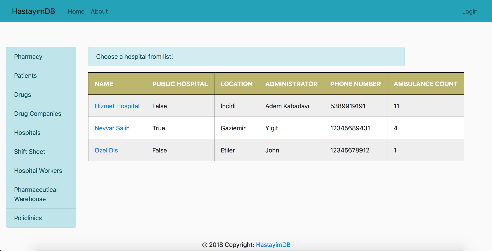
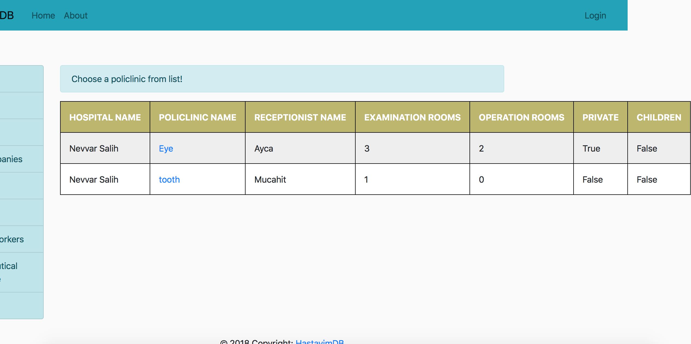

Parts Implemented by Ece Nur Şen
================================

This page will be providing information on

* *Policlinics*
* *Prescription*

1. Policlinics
--------------

Policlinics page give information about policlinics of choosen hospital and their detailed policlinics.
To go to policlinics page, user firstly press Policlinics from menu. When user pressed, 
he/she will see a page for him/her to choose a hospital.

    Choose Hospital Without Login

1.1. Policlinics Page
~~~~~~~~~~~~~~~~~~~~~

When user choose a hospital from list, user will see a list policlinics according to that hospital.

    Choosing Policlinic Without Login

.. tip:: If the user is admin or hospital administrator, user will see page different.

.. figure:: ecenur/choose_pol_w_log.png
    :scale: 40 %
    :alt: Choosing Policlinic Page
    :align: center

    Choosing Policlinic Page

Authorized user can add, delete or edit policlinics.

1.1.1. Adding New Policlinics
~~~~~~~~~~~~~~~~~~~~~~~~~~~~~

