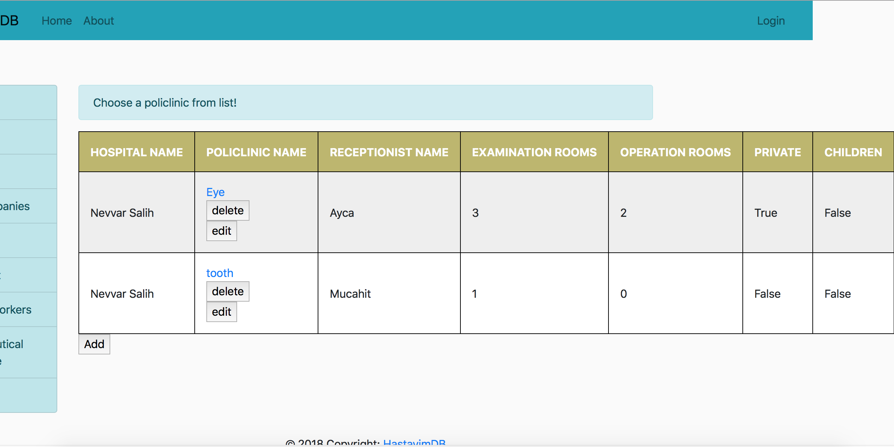
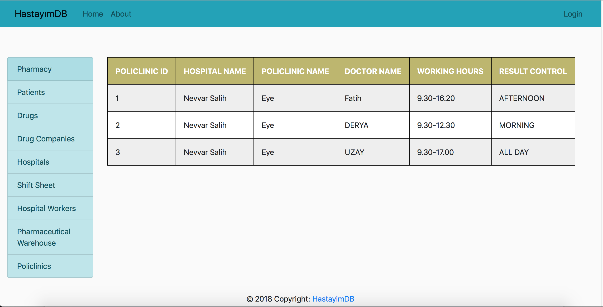

Parts Implemented by Ece Nur Şen
================================

This page will be providing information on

* *Policlinics*
* *Prescription*
* *Detailed Prescription*

1. Policlinics
--------------

Policlinics page give information about policlinics of choosen hospital and their detailed policlinics.
To go to policlinics page, user firstly press Policlinics from menu. When user pressed, 
he/she will see a page for him/her to choose a hospital.

    Choose Hospital Without Login

1.1. Policlinics Page
~~~~~~~~~~~~~~~~~~~~~

When user choose a hospital from list, user will see a list policlinics according to that hospital.

.. figure:: ecenur/choose_pol_wout_log.png
    :scale: 40 %
    :alt: Choosing Policlinic Without Login
    :align: center

    Choosing Policlinic Without Login

.. note:: If the user is admin or hospital administrator, user will see page different.

    Choosing Policlinic Page

Authorized user can add, delete or edit policlinics.

1.1.1. Adding New Policlinics
~~~~~~~~~~~~~~~~~~~~~~~~~~~~~

    Adding Policlinics

Once user enter all the necessary information, by clicking Add button, user can add new policlinics. 

.. warning:: There is a difference between policlinics and detailed policlinic. Eg. A hospital can have a policlinic called *Eye* with 3 examination rooms. Detailed policlinics of that hospital's eye policlinics contained the information of every examination rooms' information.

1.1.2. Editing Policlinics
~~~~~~~~~~~~~~~~~~~~~~~~~~

.. figure:: ecenur/edit_pol.png
    :scale: 40 %
    :alt: Editing policlinics
    :align: center

    Editing Policlinics

If user enter any information on any box and click enter, boxes with information will change accordingly.

1.1.3. Deleting Policlinics

When a user is *authorized* and on *policlinics page*, user can delete a policlinics from page by clicking delete button under the name of policlinic.

1.2. Detailed Policlinics Page
~~~~~~~~~~~~~~~~~~~~~~~~~~~~~~

A user can go to detailed policlinic page by clicking the name of policlinic.

    Detailed Policlinics Page

Detailed Policlinics page give information about, which policlinic is working during which hours, when is the result control hours and which doctor is working in that policlinics. 
A user can see this page without login.

.. note:: If the user is admin or hospital administrator, user will see page different.

.. figure:: ecenur/det_pol_w_log.png
    :scale: 40 %
    :alt: Detailed Policlinics Page
    :align: center

    Detailed Policlinics Page

Authorized user can add or delete detailed policlinics.

1.2.1. Adding Detailed Policlinic
~~~~~~~~~~~~~~~~~~~~~~~~~~~~~~~~~

.. figure:: ecenur/add_det_pol.png
    :scale: 40 %
    :alt: Adding Detailed Policlinic
    :align: center

    Adding Detailed Policlinic

Once user enters all the necessary informations, by clicking Add button, user can add detailed policlinic.

1.2.2. Deleting Detailed Policlinic
~~~~~~~~~~~~~~~~~~~~~~~~~~~~~~~~~~~

When a user is *authorized* and on *detailed policlinic page*, user can delete a detailed policlinic from page by clicking delete button under the id of policlinic.

2. Prescription
---------------

Prescription page is for observing all the prescription of a choosen patient. Because prescriptions are private, prescription page cannot be directly accessed through menu, but an authorized person can access through patient page.

.. figure:: ecenur/presc_for_patient.png
    :scale: 40 %
    :alt: Prescription Page For Patient
    :align: center

    Prescription Page

.. note:: If the user is patient or receptionist, user will see page like given above.

.. note:: If the user is admin or doctor, user will see page different.

    Prescription Page 

Admin and Doctor are authorized users of Prescription pages. Authorized can add, delete or edit Prescription Page.

2.1. Adding Prescription
~~~~~~~~~~~~~~~~~~~~~~~~

.. figure:: ecenur/add_presc.png
    :scale: 40 %
    :alt: Adding Prescription
    :align: center

    Adding Prescription

Once user enter necessary informations, by clicking Add button, user can add prescription.

.. warning:: Prescription and Detailed Prescription are different. Prescription only contains information such as when it entered, which doctor entered, validation date etc. On the other hand detailed prescription contains information about drugs and examinations.

2.2. Editing Prescription
~~~~~~~~~~~~~~~~~~~~~~~~~

    Editing Prescription

If user enter any information on any box and click enter, boxes with information will change accordingly.

2.3. Deleting Prescription
~~~~~~~~~~~~~~~~~~~~~~~~~~

When a user is *authorized* and on *prescription page*, user can delete a prescription from page by clicking delete button under the id of prescription.

3. Detailed Prescription
------------------------

A user can reach details of a prescription by clicking the id of prescriptions.
Detailed prescription consists of two parts: Drug and Examination.
First table seen on detailed prescription page is drugs table. Second table seen on detailed prescription page is examination table.

.. figure:: ecenur/det_pres_for_patient.png
    :scale: 40 %
    :alt: Detailed Prescription Page for Patient
    :align: center

    Detailed Prescription Page

.. note:: If the user is patient or receptionist, user will see page like given above.

.. note:: If the user is admin or doctor, user will see page different.

.. figure:: ecenur/det_presc_for_doctor.png
    :scale: 40 %
    :alt: Detailed Prescription Page
    :align: center

    Detailed Prescription Page

3.1. Drugs
~~~~~~~~~~

An authorized user can add, delete or edit drugs.

3.1.1. Adding Drugs
~~~~~~~~~~~~~~~~~~~

To add new drug, user will click *Add Drug* button on Detailed Prescription Page.

.. figure:: ecenur/add_drug.png
    :scale: 40 %
    :alt: Adding Drugs
    :align: center

    Adding Drugs

Once user enters all necessary informations, by clicking Add button, user can add a new drug to prescription.

3.1.2. Editing Drugs
~~~~~~~~~~~~~~~~~~~~

To edit a drug in prescription, user will click *Edit* button under id of drug on Detailed Prescription Page.

    Editing Drugs

If user enter any information on any box and click enter, boxes with information will change accordingly.

3.1.3. Deleting Drugs
~~~~~~~~~~~~~~~~~~~~~

To delete a drug in prescription, user will click *Delete* button under id of drug on Detailed Prescription Page.

3.2. Examination
~~~~~~~~~~~~~~~~

An authorized user can add or delete drugs.

3.2.1. Adding Examination
~~~~~~~~~~~~~~~~~~~~~~~~~

To add new examination, user will click *Add Examination* button on Detailed Prescription Page.

.. figure:: ecenur/add_Exam.png
    :scale: 40 %
    :alt: Adding Examination
    :align: center

    Adding Examination

Once user enters all necessary informations, by clicking Add button, user can add a new drug to prescription.

3.2.2. Deleting Examination
~~~~~~~~~~~~~~~~~~~~~~~~~~~

To delete a examination in prescription, user will click *Delete* button under id of examination on Detailed Prescription Page.

.. warning:: If a user try to reach a page that he/she is not authorized to see, user will see page below.

    Unauthorized Access
