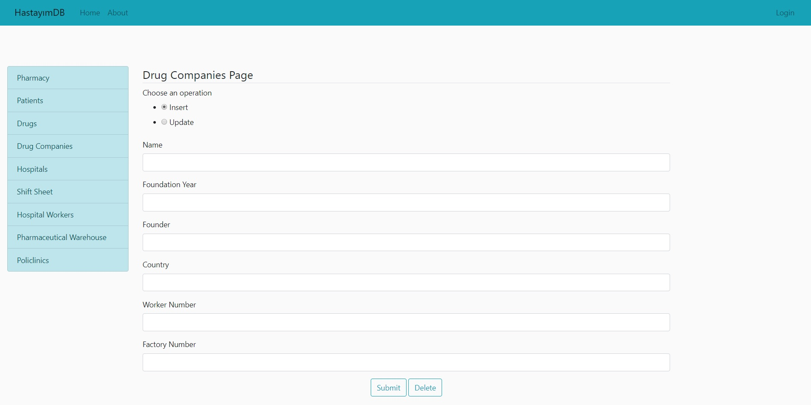

Parts Implemented by Göktuğ Başaran
================================

This page will be providing information on 

* *Patients*
* *Drugs*
* *Drug companies*

1. Patients
-------------

Patients page is only provided to medical personnel in hospitals and pharmacies.
Hospital personnel can view the patient list and access their *medical records*.
Pharmacy personnel can view the patient list and access their *prescription records*.

In order to perform operation on patients, you must login and have permission.
Once those are provided, you are eligible to operate on patients in our system and this page should be
visible to you.

.. tip:: If you cannot access this page being an authorized member, please contact the administrator.

.. figure:: insert_patient.jpg
	:scale: 50 %
	:alt: Patient Page
	:align: center
	
	Patient Page

1.1. Adding a New Patient
~~~~~~~~~~~~~~~~~~~~~~~~~~~~

From the first dialog box, pick *INSERT* and provide the necessary information about the patient
in relative boxes below. Once you have provided all the information, click *Submit* button to finalize
the process and add the patient.

.. warning:: The insurance company you type must exist in order to add the patient.

1.2. Updating a Existing Patient
~~~~~~~~~~~~~~~~~~~~~~~~~~~~~~~~~~~~~~~~~~~~

From the first dialog box, pick *UPDATE* and provide the Name of the patient. Then, fill in the necessary information that
you would like to update and then click *Submit* button to end the process and update the patient.

.. note:: If there is no patient with the given name, the operation will fail.

1.3. Deleting a Existing Patient
~~~~~~~~~~~~~~~~~~~~~~~~~~~~~~~~~~~~~~~~~~~~

Provide the name of the patient to be deleted. Then, click *DELETE* button to end the process
and delete the given patient.

.. note:: If there is no patient with the given name, the operation will fail.

1.4. Searching a Patient
~~~~~~~~~~~~~~~~~~~~~~~~~~~~~~~~~~~~~~~~~~~~

Click the *SEARCH* button and this page should be visible to you. 

.. figure:: search_patient.jpg
	:scale: 50 %
	:alt: Search Page
	:align: center
	
	Search Page

Pick the filter with which you would like to search, and provide the 
necessary information to the box below and click *FILTER*.
The results should appear via a table right below the *Filter* button.

.. note:: You do not have to specify the entire information of a patient.
	* *Eg. Searching for "A" with name filter will give you every patient with a letter "A" in their names.*
	
2. Drug Companies
------------------

In order to perform operation on drug companies, you must login and have permission.
Once those are provided, you are eligible to operate on drug companies in our system and this page should be
visible to you.

.. tip:: If you cannot access this page being an authorized member, please contact the administrator.

	
	Drug Companies

	