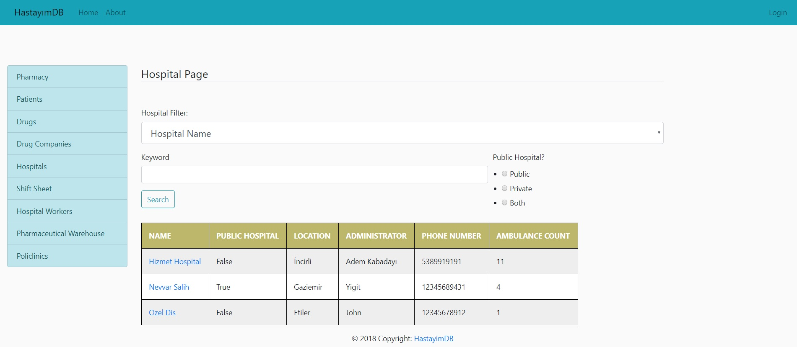

User Guide
==========

**Welcome to *HastayimDB* user guide. Here, there will be information from A to Z on 
how to completely use our application.**

* Login_
* Searching For A Hospital_
* Logging Out_

.. _Login

.. figure:: login_page.jpg
	:scale: 50 %
	:alt: Login Page
	:align: center
	
	Login Page
	
You should use your Citizenship Number (TCKN) and Password that is provided to you. After this step,
new functionalities of our application will be provided to you depending on your authorization.

.. _Hospital

	
	Hospital Search Page

Navigate to this page by clicking Hospitals from the left menu. Then, filter the hospitals by their name,
location, administrator or phone number. Unless you choose whether the hospital is private or public, the 
results will not be visible.
	
.. toctree::
   member1
   member2
   member3
   member4
   